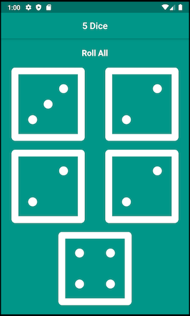

# 5 Dice 🎲

Yahtzee & Liars Dice app.

Roll all 5 dice or roll each dice individually.

---

- Stateful widgets used to update the user interface.
- onPressed listeners used to detect when buttons are pressed.
- setState used to mark the widget tree as dirty, requiring update on the next render.
- Expanded widget used to make widgets adapt to screen dimensions.

> Adapted from a companion project to The App Brewery's Complete Flutter Development Bootcamp, check out the full course at [www.appbrewery.co](https://www.appbrewery.co/)
